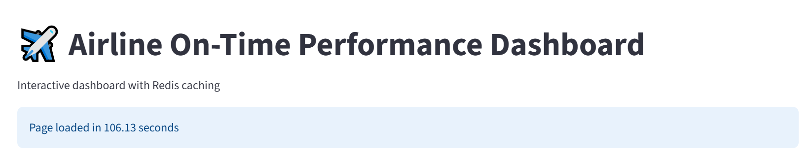
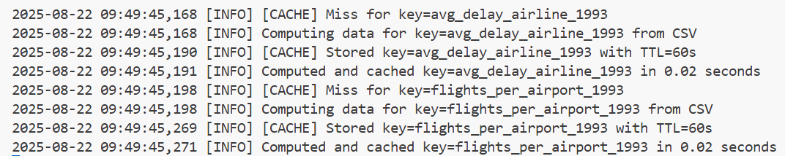
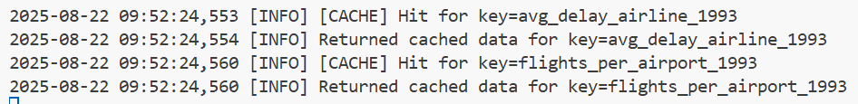
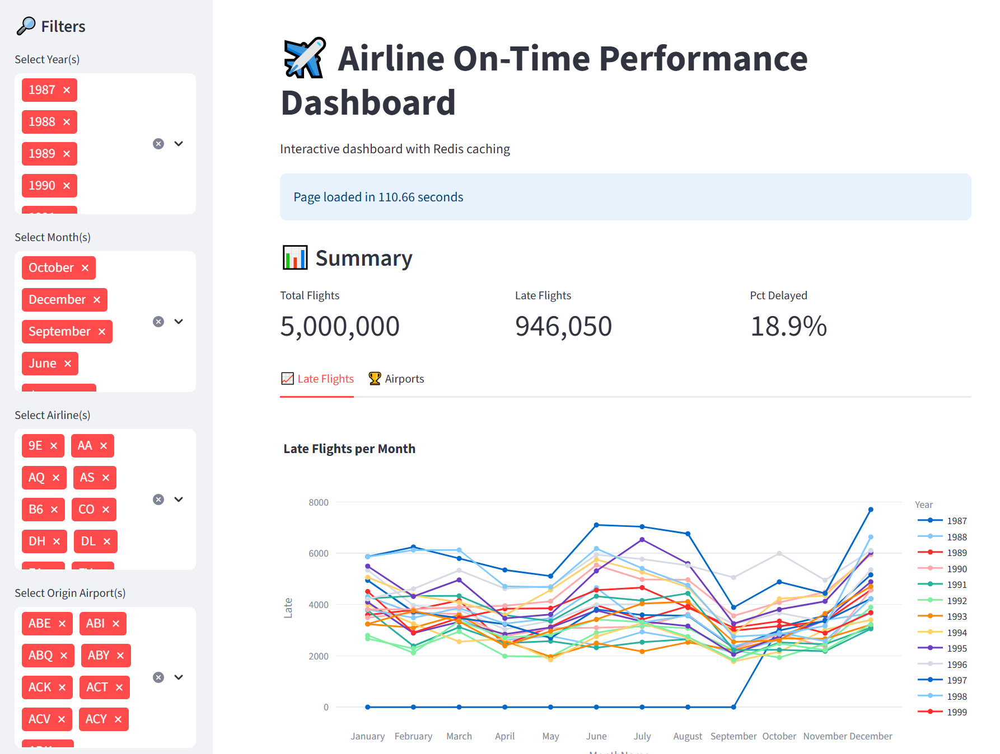

<h1> Caching a csv with Redis </h1>

<h3> Airline on-time performance data, a  massive database to handle </h3>

This project is a Streamlit interactive dashboard that analyzes the Airline On-Time Performance dataset (US flight delays) from Kaggle and demonstrates Redis caching to speed up expensive aggregations.
The project focuses on caching with Redis.

<h3> Quick overview of this repo</h3>

```bash
├── README.md  
├── docker-compose.yml  
├── .env  
├── app/  
|    ├── main.py         # Streamlit app entry point  
|    ├── cache.py        # Redis cache  
|    └── config.py       # Load env vars  
├── data/  
|    ├── airline.csv              # raw CSV  
|    ├── airline_preprocessed.csv # clean data  
|    └── preprocessing.py         # python script to clean data  
└── requirements.txt
```

<h3>Installation & Setup</h3>
1. Clone the repository  

```bash
git clone https://github.com/meganmarchale/challenge-caching-csv-redis.git
cd challenge-caching-csv-redis
```

2. Install Python dependencies
```bash
pip install -r requirements.txt
```

3. Install & run Redis

Option 1: Using Docker (recommended)
```bash
docker run -d --name redis -p 6379:6379 redis
```

Option 2: Local Redis install

Windows: https://redis.io/docs/getting-started/installation/install-redis-on-windows/  
Mac: brew install redis  
Linux: sudo apt install redis-server

4. Configure environment variables

Create a .env file in the root directory:
```bash
DATASET_PATH=./data/airline_preprocessed.csv
CACHE_TTL=60
REDIS_HOST=localhost
REDIS_PORT=6379
```

Run the app  
```bash
streamlit run app/main.py  
```
The app will load the dataset.  
The first computation fetches from CSV and caches it. Subsequent requests use Redis cache for instant results.  

**📊 Example logs:**  

>2025-08-21 23:10:18,659 [INFO] Loading preprocessed CSV...  
2025-08-21 23:10:24,509 [INFO] Loaded 5000000 rows, 11 columns  

First run: CSV computation took ~41.8s
Second run: Cache retrieval took ~0.03s ⚡

Logs will also show weather the info comes from the CSV or from the cache:

>2025-08-21 23:11:51,063 [INFO] **Computing data** for key=avg_delay_airline_1995 **from CSV**  
2025-08-21 23:11:51,079 [INFO] [CACHE] Stored key=avg_delay_airline_1995 with TTL=60s  
2025-08-21 23:11:51,081 [INFO] Computed and cached key=avg_delay_airline_1995 in 0.02 seconds  
2025-08-21 23:11:51,088 [INFO] [CACHE] Miss for key=flights_per_airport_1995  
2025-08-21 23:12:13,141 [INFO] [CACHE] **Hit** for key=avg_delay_airline_1995  
2025-08-21 23:12:13,141 [INFO] Returned cached data for key=avg_delay_airline_1995  
2025-08-21 23:12:13,148 [INFO] [CACHE] Hit for key=flights_per_airport_1995  
2025-08-21 23:12:13,148 [INFO] Returned cached data for key=flights_per_airport_1995  

The results are impressive, as caching enormously improved the speed of the page.  

Here is the first log time, with an empty cache and loading from the csv:   
  
  
Here once the app is using the cached info:  
  
  

**Using Redis caching drastically reduces response time for repeated queries.**  
TTL ensures cached results refresh automatically after a set interval.
Streamlit’s @st.cache_data also prevents repeated CSV reloads during a session.


N.B.: Although caching helped improve the performances. This app is still slow due to the lack of optimization. Something thqt still needs to be worked on!
The dataset also needs a better preprocessing as the focus here was on the caching part of the project.

**Here is an overview of the actual app.**


### Still some work to be done

The next steps include:
- Better preprocessing, cleaner data
- Improvements and modification of the charts already set
- Adding new charts and better structuring the info
- Optimizing the app so that it runs smoothly
- Complementing the charts with AI analyses
